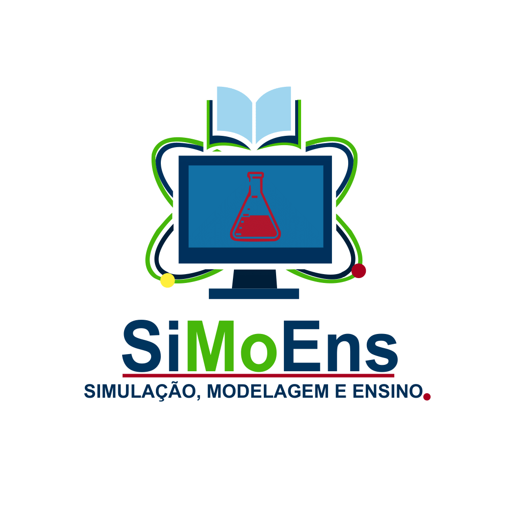

  

<h1 align="center">SiMoEns</h1>

  <strong>Ensino, modelagem e simulação em Química</strong> 
  Uma plataforma educacional aberta para explorar a ciência por meio de experiências visuais, interativas e acessíveis.

  <a href="https://quimicavisualufv.github.io/Quimica-Visual/"><strong>Acessar a plataforma</strong></a>
  ·
  <a href="https://quimicavisualufv.github.io/Quimica-Visual/Ensino/">Explorar conteúdos</a>

---

## Ciência que pode ser vista, explorada e compreendida

O **SiMoEns** reúne recursos digitais para o ensino de Química, conectando rigor científico, visualização e interação. A plataforma transforma conceitos abstratos — como orbitais, redes cristalinas, geometria molecular, polaridade e interações intermoleculares — em experiências que podem ser observadas, manipuladas e investigadas.

Mais do que um catálogo de páginas, o projeto funciona como um ecossistema de aplicações educacionais independentes, articuladas por uma mesma infraestrutura de navegação, acessibilidade, documentação e assistência contextual.

| Plataforma educacional | Conteúdo catalogado |
| --- | ---: |
| Animações e visualizadores | 10 |
| Guias interativos | 10 |
| Exercícios guiados | 8 |
| Jogos educacionais | 4 |
| Temas e termos relacionados | 88 |

## Experiências educacionais

### Animações e visualizadores

Experiências 2D e 3D para observar estruturas, fenômenos e representações científicas com controles interativos.

- orbitais atômicos e moleculares;
- átomos hidrogenoides e equações de onda;
- redes, sistemas e defeitos cristalinos;
- geometria molecular e cristalográfica;
- simetria, fórmula unitária e empacotamento;
- vidrarias e equipamentos de laboratório;
- gemas e mudança de cor.

### Guias interativos

Percursos didáticos que organizam conceitos em etapas, combinando explicações, modelos, diagramas e atividades de exploração.

- células unitárias, redes de Bravais e Wigner–Seitz;
- geometria e polaridade molecular;
- modelos atômicos e fases da água;
- complexos, polimorfismo e interações intermoleculares;
- atlas termodinâmico.

### Exercícios guiados

Atividades de fixação com validação de respostas e feedback educacional sobre geometria, polaridade, estrutura e Química do estado sólido.

### Jogos educacionais

Aprendizagem baseada em interação, estratégia e desafio por meio do **Xadrez Químico**, **Show do Milhão Químico**, **Caça-palavras e Cruzadinhas** e **Quebra-cabeça Iônico/Covalente**.

## Assistente inteligente

O Assistente do SiMoEns foi projetado para compreender tanto a pergunta quanto o lugar da plataforma em que ela foi feita.

Seu funcionamento combina:

- contexto da página e da experiência atual;
- registro canônico dos recursos educacionais;
- classificação local de intenções;
- recuperação documental com ranking BM25;
- histórico recente e acompanhamento de assunto;
- respostas determinísticas e fallback seguro;
- refinamento generativo local opcional, sem dependência obrigatória de WebGPU.

## Acessibilidade como infraestrutura

A acessibilidade faz parte da arquitetura do projeto e não é tratada como uma camada decorativa. A plataforma reúne recursos como:

- navegação por teclado e gerenciamento de foco;
- nomes, descrições e estados para tecnologias assistivas;
- suporte semântico para Canvas, WebGL, jogos e aplicações em iframe;
- contraste, escala de texto, espaçamento e guia de leitura;
- redução de movimento e ajustes para percepção de cores;
- leitura por síntese de voz;
- integração progressiva com VLibras;
- persistência e sincronização de preferências entre experiências.

Documentos textuais de acessibilidade complementam experiências cuja informação científica é apresentada visualmente.

## Compromisso científico

As experiências utilizam referências científicas, mas algumas imagens são representações didáticas. Cores, raios atômicos, distâncias, energias e concentrações podem ser qualitativos ou não estar em escala. Sempre que uma simplificação puder alterar a interpretação, ela deve ser indicada na interface ou na descrição acessível do recurso.

Materiais de apoio, modelos, cálculos e referências utilizados no desenvolvimento serão progressivamente documentados e catalogados no projeto.

## Licença

Distribuído sob a licença **MIT**. Consulte [`LICENSE`](LICENSE) para os termos completos.

## Contato

- **E-mail:** [quimicavisualufv@gmail.com](mailto:quimicavisualufv@gmail.com)
- **Endereço:** Departamento de Química — Universidade Federal de Viçosa, Viçosa — MG, 36570-900
- **Projeto online:** [quimicavisualufv.github.io/Quimica-Visual](https://quimicavisualufv.github.io/Quimica-Visual/)

---

  <strong>Educação gratuita e de qualidade para todos.</strong> 
  Ciência aberta, visual e acessível.

© SiMoEns

